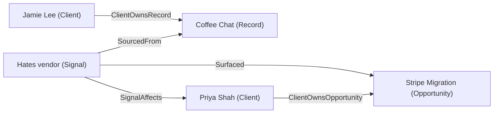
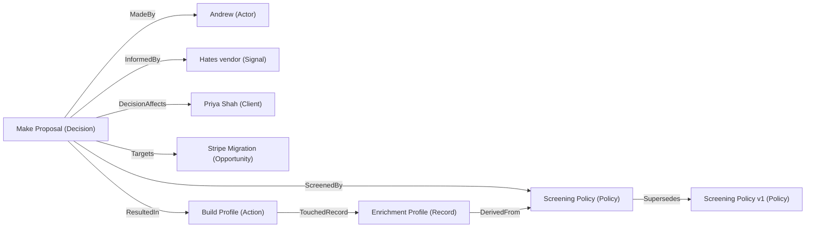
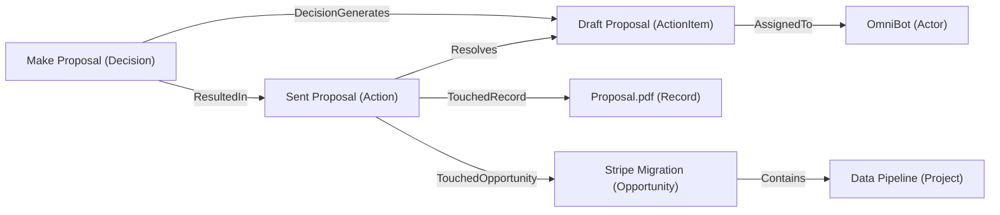

# Context Graph Example

A CRM / RevOps context graph that captures the full physics of execution — from intelligence capture through enrichment, screening, decision-making, and delivery. This example demonstrates NanoGraph's ability to model complex real-world workflows with typed nodes, edges, and decision traces.

Source files: [`examples/revops/`](https://github.com/omnilake/nanograph/tree/main/examples/revops)

## The trace

The graph captures a three-phase execution cycle. Each phase builds on the previous.

### Phase 1 — Intelligence: Signal surfaces an Opportunity

Jamie's coffee chat produces a Signal. The Signal links to who it's about and what deal it reveals.

### Phase 2 — Enrichment & Screening: Agent builds the case

The agent reads the Screening Policy, generates an Enrichment Profile based on its criteria, then the Decision is screened and passes.

### Phase 3 — Execution: Work is assigned, completed, and proven

The Decision generates work. The agent executes it, creating the proposal and advancing the deal.

